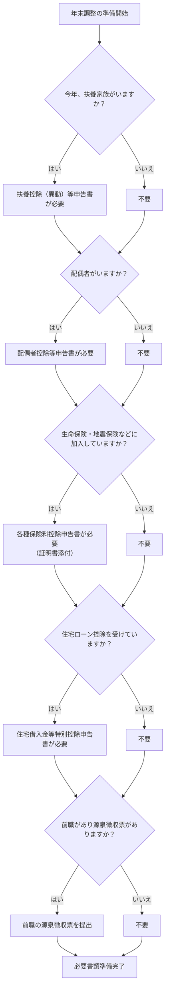
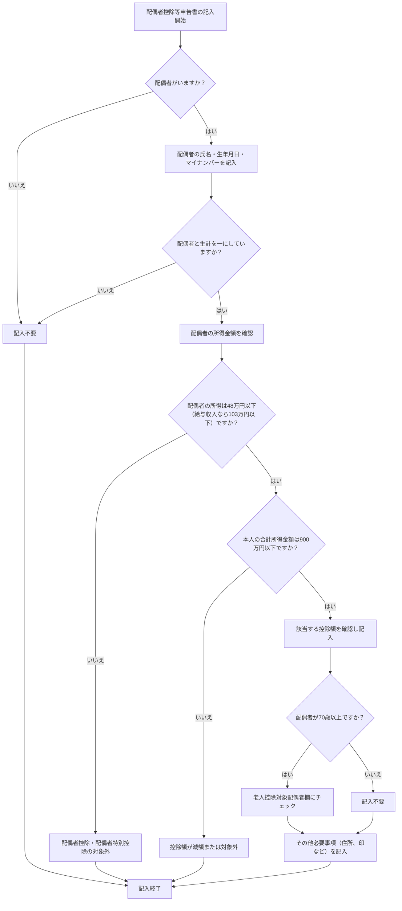
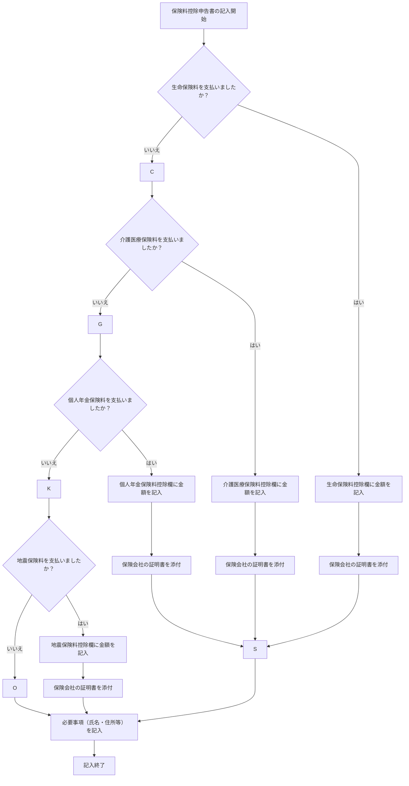

## 年末調整フロー

## 扶養控除申請書

扶養親族・・・配偶者以外で生計を1つにしている方がいる場合に起票

## 配偶者控除等申請書

## 保険料控除申請書

# 保険料控除で自分が何の控除を受けているか知る方法

## 1. 年末調整書類で確認

- 年末調整で提出した「保険料控除申告書」の控えや、会社から配布された年末調整の結果通知書（源泉徴収票）に、
  **どの控除（生命保険料控除・地震保険料控除など）を受けているか**が記載されています。
- 「保険料控除申告書」で自分が記入した控除の欄や、添付した証明書の種類を確認しましょう。
- 年末調整後に配られる「源泉徴収票」の「保険料控除額」欄も要チェックです。

## 2. 証明書で確認

- 控除対象になる保険に加入している場合、**毎年10月～11月ごろに保険会社や地震保険会社から「控除証明書」が郵送**されます。
- この証明書が届いている保険が、今年控除できる対象です。

## 3. 控除の主な種類

| 控除の種類           | 対象となるもの                   | 証明書の発行元     |
|----------------------|----------------------------------|-------------------|
| 生命保険料控除       | 生命保険、個人年金、医療保険など | 生命保険会社       |
| 介護医療保険料控除   | 介護医療保険など                 | 生命保険会社・共済等|
| 個人年金保険料控除   | 個人年金保険契約                 | 生命保険会社       |
| 地震保険料控除       | 地震保険                         | 損害保険会社       |

## 4. 控除を受けていない場合

- 控除証明書が届かない
- 申告書の該当欄に何も記入していない
- 源泉徴収票の該当欄が「0」になっている

この場合は、該当する控除を受けていません。

---

### まとめ

- 年末調整書類や控除証明書、源泉徴収票で「自分がどの保険料控除を受けているか」確認できます。
- 不明な場合は会社の担当者や、ご自身の保険会社に問い合わせても確認可能です。
